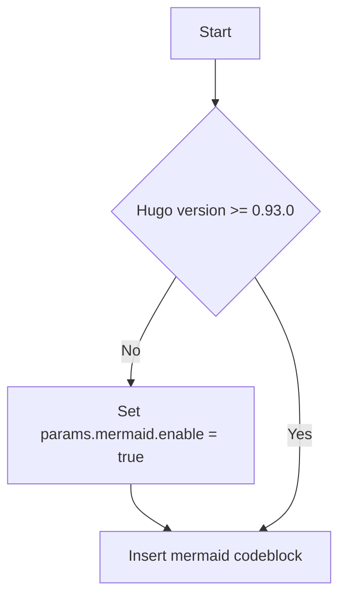

## Diagrams with Mermaid

[Mermaid](https://mermaid-js.github.io) is a Javascript library for rendering simple text definitions to useful diagrams in the browser.  It can generate a variety of different diagram types, including flowcharts, sequence diagrams, class diagrams, state diagrams, ER diagrams, user journey diagrams, Gantt charts and pie charts.

With Mermaid support enabled in Docsy, you can include the text definition of a Mermaid diagram inside a code block, and it will automatically be rendered by the browser as soon as the page loads.

The great advantage of this is anyone who can edit the page can now edit the diagram - no more hunting for the original tools and version to make a new edit.

For example, the following defines a simple flowchart:

````

````

Automatically renders to:


With hugo version 0.93 or higher, support of Mermaid diagrams is automatically enabled as soon as you use a `mermaid` code block on your page.

If you are using hugo version 0.92 or lower, you need to enable Mermaid manually by updating your `hugo.toml`/`hugo.yaml`/`hugo.json`:




[params.mermaid]
enable = true


params:
  mermaid:
    enable: true


{
  "params": {
    "mermaid": {
      "enable": true
    }
  }
}



If needed, you can define custom settings for your diagrams, such as themes, padding in your `hugo.toml`/`hugo.yaml`/`hugo.json`.




[params.mermaid]
theme = "neutral"

[params.mermaid.flowchart]
diagramPadding = 6


params:
  mermaid:
    theme: neutral
    flowchart:
      diagramPadding: 6


{
  "params": {
    "mermaid": {
      "theme": "neutral",
      "flowchart": {
        "diagramPadding": 6
      }
    }
  }
}



See the [Mermaid documentation](https://mermaid-js.github.io/mermaid/#/Setup?id=mermaidapi-configuration-defaults) for a list of defaults that can be overridden.

Settings can also be overridden on a per-diagram basis by making use of the `%%init%%` header at the start of the diagram definition.  See the [Mermaid theming documentation](https://mermaid-js.github.io/mermaid/#/theming?id=themes-at-the-local-or-current-level).

## UML Diagrams with PlantUML

[PlantUML](https://plantuml.com/en/) is an alternative to Mermaid that lets you quickly create UML diagrams, including sequence diagrams, use case diagrams, and state diagrams. Unlike Mermaid diagrams, which are entirely rendered in the browser, PlantUML uses a PlantUML server to create diagrams. You can use the provided default demo server (not recommended for production use), or run a server yourself. PlantUML offers a wider range of image types than Mermaid, so may be a better choice for some use cases.

Diagrams are defined using a simple and intuitive language. ([see PlantUML Language Reference Guide](https://plantuml.com/en/guide)).

The following example shows a use case diagram:

````
```plantuml
participant participant as Foo
actor       actor       as Foo1
boundary    boundary    as Foo2
control     control     as Foo3
entity      entity      as Foo4
database    database    as Foo5
collections collections as Foo6
queue       queue       as Foo7
Foo -> Foo1 : To actor
Foo -> Foo2 : To boundary
Foo -> Foo3 : To control
Foo -> Foo4 : To entity
Foo -> Foo5 : To database
Foo -> Foo6 : To collections
Foo -> Foo7: To queue
```
````

Automatically renders to:

```plantuml
participant participant as Foo
actor       actor       as Foo1
boundary    boundary    as Foo2
control     control     as Foo3
entity      entity      as Foo4
database    database    as Foo5
collections collections as Foo6
queue       queue       as Foo7
Foo -> Foo1 : To actor
Foo -> Foo2 : To boundary
Foo -> Foo3 : To control
Foo -> Foo4 : To entity
Foo -> Foo5 : To database
Foo -> Foo6 : To collections
Foo -> Foo7: To queue
```

To enable/disable PlantUML, update `hugo.toml`/`hugo.yaml`/`hugo.json`:




[params.plantuml]
enable = true


params:
  plantuml:
    enable: true


{
  "params": {
    "plantuml": {
      "enable": true
    }
  }
}



Other optional settings are:




[params.plantuml]
enable = true
theme = "default"

# Set url to plantuml server
# default is http://www.plantuml.com/plantuml/svg/
svg_image_url = "https://www.plantuml.com/plantuml/svg/"

# By default the plantuml implementation uses  tags to display UML diagrams.
# When svg is set to true, diagrams are displayed using <svg /> tags, maintaining functionality like links e.g.
# default = false
svg = true


params:
  plantuml:
    enable: true
    theme: default
    # Set url to plantuml server
    # default is http://www.plantuml.com/plantuml/svg/
    svg_image_url: 'https://www.plantuml.com/plantuml/svg/'
    # By default the plantuml implementation uses  tags to display UML diagrams.
    # When svg is set to true, diagrams are displayed using <svg /> tags, maintaining functionality like links e.g.
    # default = false
    svg: true


{
  "params": {
    "plantuml": {
      "enable": true,
      "theme": "default",
      "svg_image_url": "https://www.plantuml.com/plantuml/svg/",
      "svg": true
    }
  }
}



## MindMap support with MarkMap

[MarkMap](https://markmap.js.org/) is a Javascript library for rendering simple text definitions to MindMap in the browser.

For example, the following defines a simple MindMap:

````
```markmap
# markmap

## Links

- <https://markmap.js.org/>
- [GitHub](https://github.com/gera2ld/markmap)

## Related

- [coc-markmap](https://github.com/gera2ld/coc-markmap)
- [gatsby-remark-markmap](https://github.com/gera2ld/gatsby-remark-markmap)

## Features

- links
- **inline** ~~text~~ *styles*
- multiline
  text
- `inline code`
-
    ```js
    console.log('code block');
    ```
- Katex - $x = {-b \pm \sqrt{b^2-4ac} \over 2a}$
```
````

Automatically renders to:

```markmap
# markmap

## Links

- <https://markmap.js.org/>
- [GitHub](https://github.com/gera2ld/markmap)

## Related

- [coc-markmap](https://github.com/gera2ld/coc-markmap)
- [gatsby-remark-markmap](https://github.com/gera2ld/gatsby-remark-markmap)

## Features

- links
- **inline** ~~text~~ *styles*
- multiline
  text
- `inline code`
-
    ```js
    console.log('code block');
    ```
- Katex - $x = {-b \pm \sqrt{b^2-4ac} \over 2a}$
```

To enable/disable MarkMap, update `hugo.toml`/`hugo.yaml`/`hugo.json`:




[params.markmap]
enable = true


params:
  markmap:
    enable: true


{
  "params": {
    "markmap": {
      "enable": true
    }
  }
}



## Diagrams with Diagrams.net

[Diagrams.net](https://diagrams.net/) (aka draw.io) provides a free and open source diagram editor that can generate a wider range of diagrams than Mermaid or PlantUML using a web or desktop editor.

SVG and PNG files exported with the tool contain the source code of the original diagram by default, which allows the diagrams.net site to import those images again for edit in the future.  Docsy can detect this and automatically add an "edit" button over any image that can be edited using the online site.

Hover over the image below and click edit to instantly start working with it.  Clicking the "Save" button will cause the edited diagram to be exported using the same filename and filetype, and downloaded to your browser.

{}
If you're creating a new diagram, be sure to File -> Export in either svg or png format (svg is usually the best choice) and ensure the "Include a copy of my diagram" is selected so it can be edited again later.
{}

As the diagram data is transported via the browser, the diagrams.net server does not need to access the content on your Docsy server directly at all.




To disable detection of diagrams, update `hugo.toml`/`hugo.yaml`/`hugo.json`:




[params.drawio]
enable = false


params:
  drawio:
    enable: false


{
  "params": {
    "drawio": {
      "enable": false
    }
  }
}



You can also [deploy and use your own server](https://github.com/jgraph/docker-drawio/blob/master/README.md) for editing diagrams, in which case update the configuration to point to that server:




[params.drawio]
drawio_server = "https://app.mydrawioserver.example.com"


params:
  drawio:
    drawio_server: 'https://app.mydrawioserver.example.com'


{
  "params": {
    "drawio": {
      "drawio_server": "https://app.mydrawioserver.example.com"
    }
  }
}




## Diagrams from Kroki

## Inline Diagrams

[Kroki](https://kroki.io) is a web service for rendering ....

```kroki {type=GraphViz disabled=true}
digraph D {
  subgraph cluster_p {
    label = "Kroki";
    subgraph cluster_c1 {
      label = "Server";
      Filebeat;
      subgraph cluster_gc_1 {
        label = "Docker/Server";
        Java;
      }
      subgraph cluster_gc_2 {
        label = "Docker/Mermaid";
        "Node.js";
        "Puppeteer";
        "Chrome";
      }
    }
    subgraph cluster_c2 {
      label = "CLI";
      Golang;
    }
  }
}
```


```kroki {type=Vega format=svg disabled=true}
{
  "$schema": "https://vega.github.io/schema/vega/v5.json",
  "width": 400,
  "height": 200,
  "padding": 5,

  "data": [
    {
      "name": "table",
      "values": [
        {"category": "A", "amount": 28},
        {"category": "B", "amount": 55},
        {"category": "C", "amount": 43},
        {"category": "D", "amount": 91},
        {"category": "E", "amount": 81},
        {"category": "F", "amount": 53},
        {"category": "G", "amount": 19},
        {"category": "H", "amount": 87}
      ]
    }
  ],

  "signals": [
    {
      "name": "tooltip",
      "value": {},
      "on": [
        {"events": "rect:mouseover", "update": "datum"},
        {"events": "rect:mouseout",  "update": "{}"}
      ]
    }
  ],

  "scales": [
    {
      "name": "xscale",
      "type": "band",
      "domain": {"data": "table", "field": "category"},
      "range": "width",
      "padding": 0.05,
      "round": true
    },
    {
      "name": "yscale",
      "domain": {"data": "table", "field": "amount"},
      "nice": true,
      "range": "height"
    }
  ],

  "axes": [
    { "orient": "bottom", "scale": "xscale" },
    { "orient": "left", "scale": "yscale" }
  ],

  "marks": [
    {
      "type": "rect",
      "from": {"data":"table"},
      "encode": {
        "enter": {
          "x": {"scale": "xscale", "field": "category"},
          "width": {"scale": "xscale", "band": 1},
          "y": {"scale": "yscale", "field": "amount"},
          "y2": {"scale": "yscale", "value": 0}
        },
        "update": {
          "fill": {"value": "steelblue"}
        },
        "hover": {
          "fill": {"value": "red"}
        }
      }
    },
    {
      "type": "text",
      "encode": {
        "enter": {
          "align": {"value": "center"},
          "baseline": {"value": "bottom"},
          "fill": {"value": "#333"}
        },
        "update": {
          "x": {"scale": "xscale", "signal": "tooltip.category", "band": 0.5},
          "y": {"scale": "yscale", "signal": "tooltip.amount", "offset": -2},
          "text": {"signal": "tooltip.amount"},
          "fillOpacity": [
            {"test": "datum === tooltip", "value": 0},
            {"value": 1}
          ]
        }
      }
    }
  ]
}
```

You can also [deploy and use your own server](https://docs.kroki.io/kroki/setup/install/) in which case update the configuration to point to that server:




[params.kroki]
kroki_server = "https://local.kroki.tld"


params:
  kroki:
    kroki_server: 'https://local.kroki.tld'


{
  "params": {
    "kroki": {
      "kroki_server": "https://local.kroki.tld"
    }
  }
}



## Read content from file

{{/*< kroki type="actdiag" file="diagram.txt"  />*/}}
