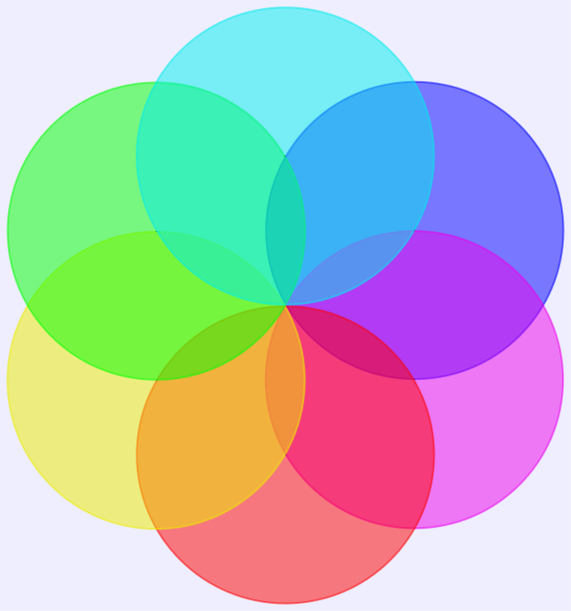

```dot { format="png"}
graph Transparency {
	layout=neato
	start=11 // empiric value to set orientation
	bgcolor="#0000ff11"
	node [shape=circle width=2.22 label="" style=filled]
	5 [color="#0000ff80"]
	6 [color="#ee00ee80"]
	1 [color="#ff000080"]
	2 [color="#eeee0080"]
	3 [color="#00ff0080"]
	4 [color="#00eeee80"]
	1 -- 2 -- 3 -- 4 -- 5 -- 6 -- 1
}
```