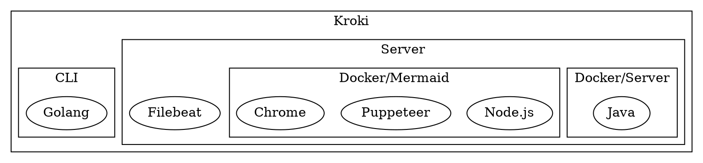
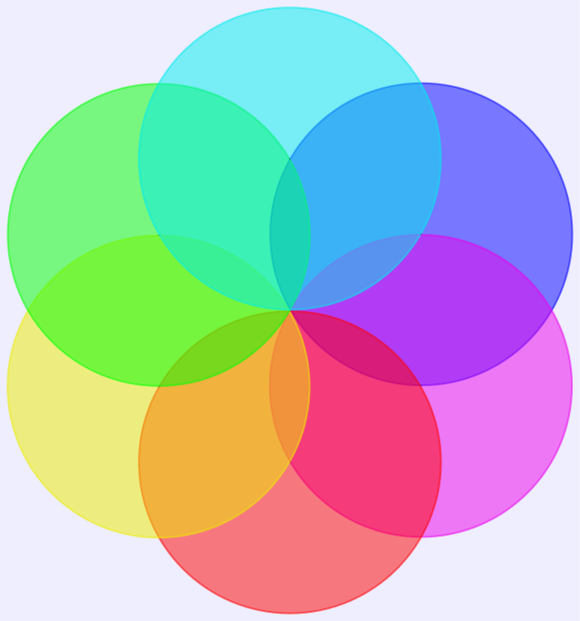

```graphviz {type=GraphViz disabled=false format="svg" scale=72.0 }
digraph D {
  subgraph cluster_p {
    label = "Kroki";
    subgraph cluster_c1 {
      label = "Server";
      Filebeat;
      subgraph cluster_gc_1 {
        label = "Docker/Server";
        Java;
      }
      subgraph cluster_gc_2 {
        label = "Docker/Mermaid";
        "Node.js";
        "Puppeteer";
        "Chrome";
      }
    }
    subgraph cluster_c2 {
      label = "CLI";
      Golang;
    }
  }
}
```

```dot { format="png"}
graph Transparency {
	layout=neato
	start=11 // empiric value to set orientation
	bgcolor="#0000ff11"
	node [shape=circle width=2.22 label="" style=filled]
	5 [color="#0000ff80"]
	6 [color="#ee00ee80"]
	1 [color="#ff000080"]
	2 [color="#eeee0080"]
	3 [color="#00ff0080"]
	4 [color="#00eeee80"]
	1 -- 2 -- 3 -- 4 -- 5 -- 6 -- 1
}
```

