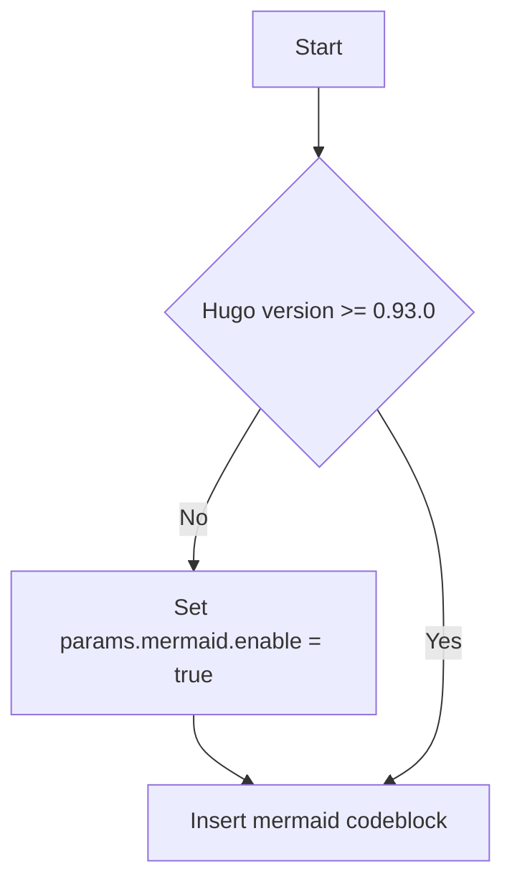

## Overview and example diagrams

The [actdiag library](https://github.com/blockdiag/actdiag) allows you do generate activity diagrams via a textual description of the activity to be depicted. Use the [documentation](http://blockdiag.com/en/actdiag/) for syntax details.
You may find this [example diagram](http://blockdiag.com/en/actdiag/examples.html) useful, too.

## Authoring your activity diagram

### Diagram source embedded in code block

To embed an activity diagram in your page, use a `actdiag` code block and put the diagram source in the body of the block. An example is given below:

````

````

The code block above renders to this activity diagram:


### Reading diagram source from file

For more complex activity diagrams, there is the option to read the diagram source from a file. To do so, pass the parameter `sourcefile` as attribute of the code block:


```mermaid-kroki { sourcefile="mermaid-simple.diag" }
```


Using this [source file](mermaid-simple.diag), the same diagram as above is shown.

## Supported output formats

The default output format is `svg`. By using the `format` option (see below), you can opt for `png` or `pdf` as output format, too. 

## Diagram options

Your diagram can be customized using the options listed below: 

| Option name     | Allowable values                                  | Description                                  |
|-----------------|---------------------------------------------------|----------------------------------------------|
| sourcefile      | string                                            | Name of file containing diagram source code  |
| format          | _svg_, _png_ or _pdf_                             | Output format of generated diagram image     |
| disabled        | boolean,<br>_true_ or _false_                     | Disable/skip diagram                         |
| antialias       | flag,<br>empty string ("")                        | Pass diagram image to anti-alias filter      |
| no-transparency | flag,<br>empty string ("")                        | No transparent diagram background (PNG only) |
| size            | dimensions,<br>_width_x_height_<br>e.g. _320x240_ | Size of diagram                              |
| no-doctype      | flag,<br>empty string ("")                        | Omit doctype definition tags (SVG only)      |

If you want to make use of these option(s), you have to give them as attributes to your `actdiag` code block, as shown in the listing below:

````
```actdiag { format="svg" disabled=false antialias="" no-transparency="" size="30x30" no-doctype="" }
diagram source goes here
```
````

Alternatively, when reading the diagram source from a file, the parameters can be given inside the code block, too. Use the json format for notation inside the body of your block:

````
```actdiag { sourcefile="act-simple.diag" format="svg" disabled=false antialias="" no-transparency="" size="30x30" no-doctype="" }
{
  "format": "svg",
  "disabled": "false",
  "antialias": "",
  "no-transparency": "",
  "size": "30x30"
}
```
````

