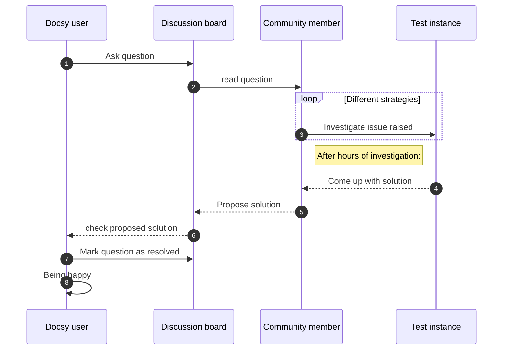

## Overview and example diagrams

The [mermaid](https://mermaid.js.org) diagramming and charting tool lets you create diagrams and visualizations via a textual description. Mermaid provides several different diagram types, like sequence, class and state diagram, Pie or quadrant chart, mindmap, timeline and many more. Use the [documentation](https://mermaid.js.org/intro/) for syntax details.
You may have a look at the provided [example diagrams](https://mermaid.js.org/syntax/examples.html) to see what's possible with mermaid.

{}
This page describes how to retrieve a mermaid diagram using the [kroki online diagram service](https://kroki.io). As an alternative, you can generate your [mermaid diagram natively](/docs/adding-content/diagrams/mermaid/), using docsy's built-in `mermaid` shortcode.
{}

## Authoring a sequence diagram (example use case)

### Diagram source embedded in code block

To embed a sequence diagram in your page, use a `mermaid-kroki` code block and put the diagram source in the body of the block. An example is given below:

````

````

The code block above renders to this sequence diagram:


### Reading diagram source from file

For more complex diagrams, there is the option to read the diagram source from a file. To do so, pass the parameter `sourcefile` as attribute of the code block:

````
```mermaid-kroki { sourcefile="mermaid-sequence.diag" }
```
````

Using this [source file](mermaid-sequence.diag), the same diagram as above is shown.

## Supported output formats

The default output format is `svg`. By using the `format` option (see below), you can opt for `png` as output format, too. 

## Diagram options

Your diagram can be customized using the options listed below: 

| Option name     | Allowable values                                  | Description                                  |
|-----------------|---------------------------------------------------|----------------------------------------------|
| sourcefile      | string                                            | Name of file containing diagram source code  |
| format          | _svg_or _png_                                     | Output format of generated diagram image     |
| disabled        | boolean,<br>_true_ or _false_                     | Disable/skip diagram                         |

Furthermore, there a many mermaid config options, provided by mermaid. For the full ist of options, have a look at the [Mermaid source code](https://github.com/mermaid-js/mermaid/blob/master/packages/mermaid/src/config.type.ts).

If you want to make use of these option(s), you have to give them as attributes to your `mermaid-kroki` code block, as shown in the listing below:

````
```mermaid-kroki { format="svg" disabled=false theme="forest" }
diagram source goes here
```
````

Alternatively, when reading the diagram source from a file, the parameters can be given inside the code block, too. Use the json format for notation inside the body of your block:

````
```mermaid-kroki { sourcefile="mermaid-sequence.diag" format="svg" }
{
  "theme": "forest"
}
```
````
