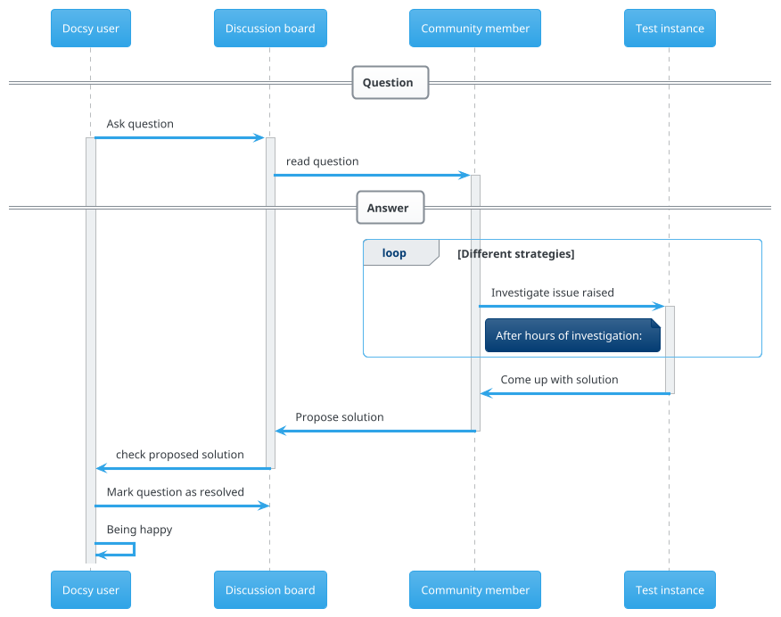

## Overview and example diagrams

The [PlantUML](https://plantuml.com) diagramming tool lets you create diagrams and visualizations via a textual description. PlantUML provides several different diagram types, like sequence, usecase, class, object, activity, component, deployment, state and timing diagrams. Use the [documentation](https://plantuml.com/en/guide) for syntax details.
You may have a look at the provided [example diagrams](https://real-world-plantuml.com/) to see what's possible with PlantUML.

{}
This page describes how to retrieve a PlantUML diagram using the [kroki online diagram service](https://kroki.io). As an alternative, you can generate your [plantuml diagram natively](), using docsy's built-in `plantuml` shortcode.
{}

## Authoring a sequence diagram (example use case)

### Diagram source embedded in code block

To embed a sequence diagram in your page, use a `plantuml-kroki` code block and put the diagram source in the body of the block. An example is given below:

````
```plantuml-kroki
== Question ==
!theme cerulean
"Docsy user" -> "Discussion board": Ask question
activate "Docsy user"
activate "Discussion board"
"Discussion board" -> "Community member": read question
activate "Community member"
== Answer ==
loop Different strategies
"Community member" -> "Test instance": Investigate issue raised
activate "Test instance"
note left of "Test instance": After hours of investigation:
end
"Test instance" -> "Community member": Come up with solution
deactivate "Test instance"
"Community member" -> "Discussion board": Propose solution
deactivate "Community member"
"Discussion board" -> "Docsy user": check proposed solution
deactivate "Discussion board"
"Docsy user" -> "Discussion board": Mark question as resolved
"Docsy user" -> "Docsy user": Being happy
```
````

The code block above renders to this sequence diagram:



### Reading diagram source from file

For more complex diagrams, there is the option to read the diagram source from a file. To do so, pass the parameter `sourcefile` as attribute of the code block:

````
```plantuml-kroki { sourcefile="plantuml-sequence.diag" }
```
````

Using this [source file](plantuml-sequence.diag), the same diagram as above is shown.

{}
The source file needs to be a [page resource](https://gohugo.io/content-management/page-resources/) bundled to the page containing the PlantUML diagram.
{}

## Supported output formats

The default output format is `svg`. By using the `format` option (see below), you can opt for `png`, `jpg`, `base64` or `pdf` as output format, too. 

## Diagram options

Your diagram can be customized using the options listed below: 

| Option name     | Allowable values                                  | Description                                  |
|-----------------|---------------------------------------------------|----------------------------------------------|
| sourcefile      | string                                            | Name of file containing diagram source code  |
| format          | _svg_, _png_, _jpg_, _txt_ or _base64_            | Output format of generated diagram image     |
| disabled        | boolean,<br>_true_ or _false_                     | Disable/skip diagram                         |
| theme           | string or number:<br>- _amiga_<br>- _black-knight_<br>- _bluegray <br>- _blueprint_<br>- _cerulean-outline_<br>- _cerulean_<br>- _crt-amber_<br>- _crt-green_<br>- _cyborg-outline_<br>- _cyborg_ (101)<br>- _hacker_<br>- _hacker-hold_<br>- _lightgray_<br>- _materia-outline_<br>- _materia_<br>- _metal_<br>- _mimeograph_ <br>- _minty_<br>- _plain_<br>- _resume-light <br>- _sandstone_<br>- _silver_<br>- _sketchy-outline_<br>- _sketchy_<br>- _spacelab_<br>- _superhero-outline_<br>- _superhero_ (101)<br>- _united_ |   |

If you want to make use of these option(s), you have to give them as attributes to your `actdiag` code block, as shown in the listing below:

````
```plantuml-kroki { format="svg" disabled=false theme="superhero" }
diagram source goes here
```
````

Alternatively, when reading the diagram source from a file, the parameters can be given inside the code block, too. Use the json format for notation inside the body of your block:

````
```plantuml-kroki { sourcefile="plantuml-sequence.diag" format="svg" }
{
  "theme" : "superhero"
}
```
````
