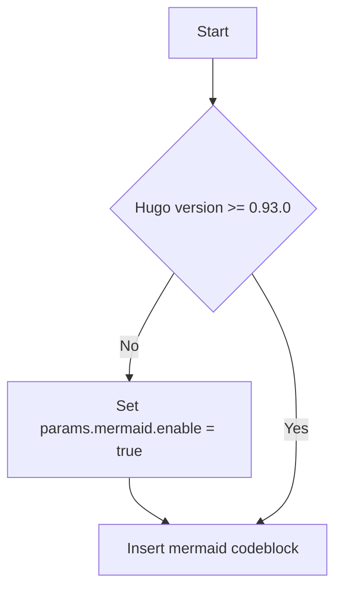

[Mermaid](https://mermaid-js.github.io) is a Javascript library for rendering simple text definitions to useful diagrams in the browser.  It can generate a variety of different diagram types, including flowcharts, sequence diagrams, class diagrams, state diagrams, ER diagrams, user journey diagrams, Gantt charts and pie charts.

With Mermaid support enabled in Docsy, you can include the text definition of a Mermaid diagram inside a code block, and it will automatically be rendered by the browser as soon as the page loads.

The great advantage of this is anyone who can edit the page can now edit the diagram - no more hunting for the original tools and version to make a new edit.

For example, the following defines a simple flowchart:

````

````

Automatically renders to:


With hugo version 0.93 or higher, support of Mermaid diagrams is automatically enabled as soon as you use a `mermaid` code block on your page.

If you are using hugo version 0.92 or lower, you need to enable Mermaid manually by updating your `hugo.toml`/`hugo.yaml`/`hugo.json`:




[params.mermaid]
enable = true


params:
  mermaid:
    enable: true


{
  "params": {
    "mermaid": {
      "enable": true
    }
  }
}



If needed, you can define custom settings for your diagrams, such as themes, padding in your `hugo.toml`/`hugo.yaml`/`hugo.json`.




[params.mermaid]
theme = "neutral"

[params.mermaid.flowchart]
diagramPadding = 6


params:
  mermaid:
    theme: neutral
    flowchart:
      diagramPadding: 6


{
  "params": {
    "mermaid": {
      "theme": "neutral",
      "flowchart": {
        "diagramPadding": 6
      }
    }
  }
}



See the [Mermaid documentation](https://mermaid-js.github.io/mermaid/#/Setup?id=mermaidapi-configuration-defaults) for a list of defaults that can be overridden.

Settings can also be overridden on a per-diagram basis by making use of the `%%init%%` header at the start of the diagram definition.  See the [Mermaid theming documentation](https://mermaid-js.github.io/mermaid/#/theming?id=themes-at-the-local-or-current-level).
