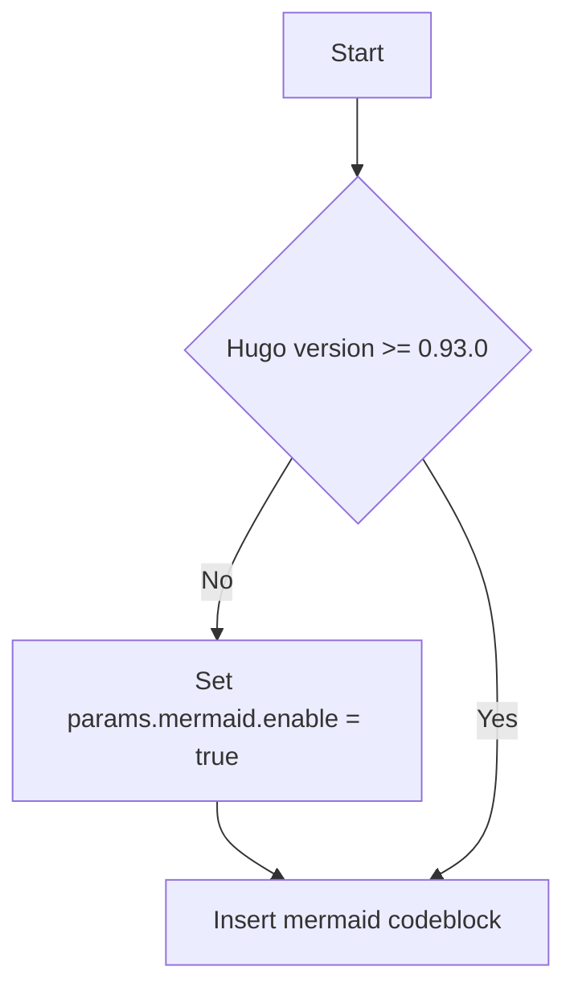

```mermaid-kroki {  }
graph TD
  Start --> Need{"Hugo version >= 0.93.0"}
  Need -- No --> Off["Set params.mermaid.enable = true"]
  Off --> Author
  Need -- Yes --> Author[Insert mermaid codeblock]
```

